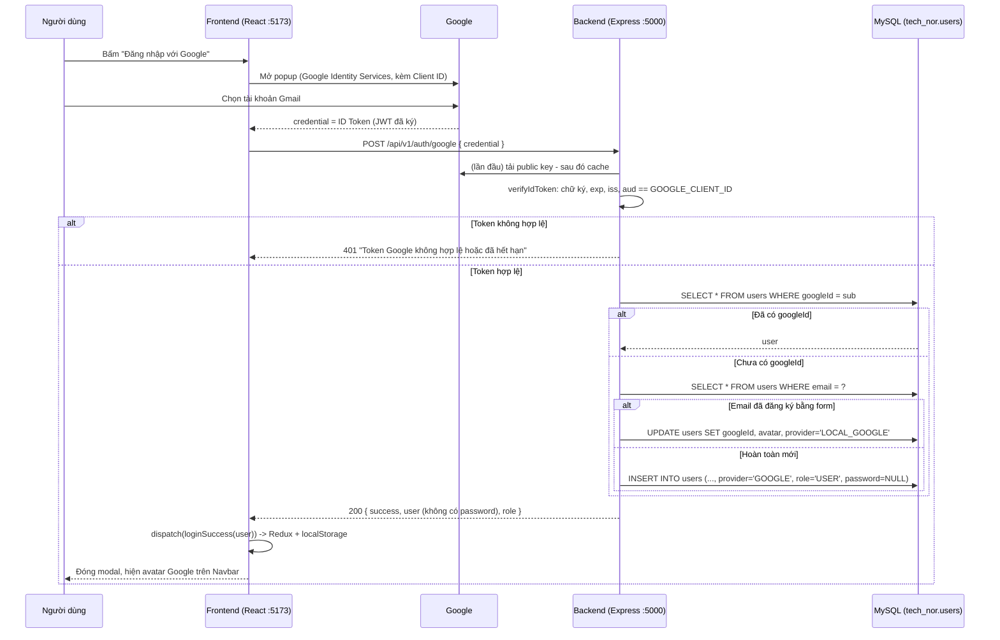

# ĐĂNG NHẬP BẰNG GOOGLE (GMAIL) — PHÂN TÍCH & HƯỚNG DẪN CHI TIẾT

> Tài liệu này giải thích **tính năng "Đăng nhập với Google"** trong dự án Tech-Nor: tại sao chọn cách làm này,
> luồng dữ liệu đi như thế nào, dùng API nào của Google, database lưu ra sao, và từng file đã sửa gì.

---

## MỤC LỤC

1. [Tổng quan: Đăng nhập Google hoạt động thế nào?](#1-tổng-quan)
2. [Chọn cách làm: ID Token flow (và tại sao không chọn cách khác)](#2-chọn-cách-làm)
3. [Sơ đồ luồng đầy đủ](#3-sơ-đồ-luồng-đầy-đủ)
4. [Cài đặt trên Google Cloud Console (lấy Client ID)](#4-cài-đặt-google-cloud-console)
5. [Database: thay đổi bảng `users` và cách lưu](#5-database)
6. [Backend: từng file đã sửa](#6-backend)
7. [Frontend: từng file đã sửa](#7-frontend)
8. [3 tình huống khi user đăng nhập Google](#8-ba-tình-huống)
9. [Bảo mật: những điểm quan trọng](#9-bảo-mật)
10. [Cách chạy & kiểm thử](#10-cách-chạy--kiểm-thử)
11. [Hạn chế hiện tại & hướng nâng cấp](#11-hạn-chế--hướng-nâng-cấp)

---

## 1. Tổng quan

Khi bạn bấm **"Đăng nhập với Google"**:

1. Google hiện popup để bạn chọn tài khoản Gmail.
2. Google trả về cho trình duyệt một **ID Token** — đây là một chuỗi **JWT** (JSON Web Token) do Google **ký số**, bên trong chứa thông tin của bạn: email, tên, ảnh đại diện, và một mã định danh duy nhất (`sub`).
3. Frontend gửi ID Token này lên backend của mình.
4. Backend **xác minh** token với Google (chữ ký có đúng của Google không, có hết hạn không, có phải cấp cho app mình không).
5. Nếu hợp lệ → backend **tìm hoặc tạo** user trong MySQL → trả thông tin user về frontend.
6. Frontend lưu user vào Redux + localStorage, giống hệt đăng nhập bằng mật khẩu.

> 💡 **Điểm mấu chốt**: Mật khẩu Gmail của bạn **không bao giờ** đi qua server Tech-Nor. Google lo việc xác thực, mình chỉ nhận "giấy chứng nhận" (ID Token) và kiểm tra giấy đó có thật không.

### Một ID Token trông như thế nào?

JWT gồm 3 phần ngăn cách bởi dấu chấm: `header.payload.signature`. Phần `payload` sau khi giải mã base64 có dạng:

```json
{
  "iss": "https://accounts.google.com",          // ai phát hành token -> Google
  "aud": "123456-abc.apps.googleusercontent.com", // token cấp cho app nào -> Client ID của mình
  "sub": "109876543210987654321",                 // ID DUY NHẤT của tài khoản Google (không bao giờ đổi)
  "email": "nguyenvana@gmail.com",
  "email_verified": true,
  "name": "Nguyễn Văn A",
  "picture": "https://lh3.googleusercontent.com/a/...",
  "iat": 1759622400,                              // thời điểm phát hành
  "exp": 1759626000                               // thời điểm hết hạn (~1 giờ sau)
}
```

Phần `signature` là chữ ký bằng **private key của Google**. Chỉ Google có private key, nên không ai làm giả được token. Backend kiểm tra chữ ký bằng **public key** Google công bố công khai.

---

## 2. Chọn cách làm

Có 3 cách phổ biến để làm đăng nhập Google:

| Cách | Mô tả | Ưu | Nhược |
|---|---|---|---|
| **A. ID Token flow** *(đã chọn)* | Frontend dùng Google Identity Services lấy ID Token, gửi lên backend verify | Đơn giản, không cần Client Secret, không cần redirect URL | Chỉ lấy được thông tin đăng nhập (không gọi được Gmail/Drive API) |
| B. Authorization Code flow | Redirect sang Google → Google redirect về backend kèm `code` → backend đổi `code` lấy token bằng Client Secret | Lấy được access token để gọi API Google khác | Phức tạp hơn: cần Client Secret, redirect URI, xử lý callback |
| C. Passport.js / Firebase Auth | Dùng thư viện/dịch vụ trung gian | Ít code | Thêm phụ thuộc lớn, khó hiểu bản chất khi học |

**Tại sao chọn A?** Mục tiêu của mình chỉ là *"biết người này là ai"* (email, tên, avatar) để đăng nhập — không cần đọc Gmail hay Drive của họ. ID Token flow đủ dùng, ít bước nhất, và **không cần lưu Client Secret** ở đâu cả (Client ID là thông tin công khai).

### Thư viện sử dụng

| Nơi | Thư viện | Vai trò |
|---|---|---|
| Frontend | [`@react-oauth/google`](https://www.npmjs.com/package/@react-oauth/google) | Bọc **Google Identity Services** (script `https://accounts.google.com/gsi/client`) thành component React `<GoogleLogin />` |
| Backend | [`google-auth-library`](https://www.npmjs.com/package/google-auth-library) | Thư viện chính thức của Google, dùng hàm `OAuth2Client.verifyIdToken()` để xác minh ID Token |

### API của Google được dùng

| API / Endpoint | Ai gọi | Để làm gì |
|---|---|---|
| `https://accounts.google.com/gsi/client` | Trình duyệt (tự động qua `@react-oauth/google`) | Tải script hiển thị nút & popup chọn tài khoản |
| `https://www.googleapis.com/oauth2/v1/certs` | Backend (tự động bên trong `verifyIdToken`) | Tải **public key** của Google để kiểm tra chữ ký JWT. Được cache, không gọi mỗi request |

> Backend **không** gọi API nào kiểu "hỏi Google user này là ai" mỗi lần đăng nhập. Nó chỉ kiểm tra chữ ký offline bằng public key đã cache → nhanh.

---

## 3. Sơ đồ luồng đầy đủ



---

## 4. Cài đặt Google Cloud Console

Để Google chịu cấp ID Token cho app của mình, cần đăng ký app và lấy **Client ID**:

1. Vào <https://console.cloud.google.com/> → tạo Project mới (vd: `technor`).
2. Menu **APIs & Services → OAuth consent screen**:
   - User Type: **External** → điền tên app, email hỗ trợ → Save.
   - Ở chế độ *Testing*, thêm Gmail của bạn vào **Test users** (chỉ những Gmail này đăng nhập được cho tới khi bạn publish app).
3. Menu **APIs & Services → Credentials → Create Credentials → OAuth client ID**:
   - Application type: **Web application**
   - **Authorized JavaScript origins**: thêm
     - `http://localhost:5173`
     - `http://localhost`
   - **Authorized redirect URIs**: *để trống* (ID Token flow dùng popup, không cần redirect).
4. Copy **Client ID** (dạng `xxxxxxxx.apps.googleusercontent.com`). **Không cần** Client Secret.
5. Dán vào 2 file env (phải **giống hệt nhau**):

```bash
# backend/.env
GOOGLE_CLIENT_ID=xxxxxxxx.apps.googleusercontent.com

# frontend/.env   (tạo mới file này, copy từ frontend/.env.example)
VITE_GOOGLE_CLIENT_ID=xxxxxxxx.apps.googleusercontent.com
```

> ❓ **Tại sao frontend phải có tiền tố `VITE_`?** Vite chỉ đưa ra trình duyệt những biến môi trường bắt đầu bằng `VITE_` — đây là cơ chế an toàn để bạn không vô tình lộ bí mật (như mật khẩu DB) ra frontend. Client ID là công khai nên đặt ở frontend không sao.
>
> ❓ **Tại sao backend cũng cần Client ID?** Để kiểm tra trường `aud` trong token. Nếu không kiểm tra, kẻ xấu có thể lấy ID Token từ **một app khác** (do họ tạo) rồi gửi cho server mình — token đó vẫn có chữ ký thật của Google! Kiểm tra `aud == GOOGLE_CLIENT_ID` đảm bảo token được cấp **cho chính Tech-Nor**.

> ⚠️ Sau khi sửa file `.env`, phải **khởi động lại** cả `npm run dev` của backend lẫn frontend thì mới nhận giá trị mới.

---

## 5. Database

### 5.1. Thay đổi trong `backend/prisma/schema.prisma`

```prisma
model User {
  id       Int     @id @default(autoincrement())
  email    String  @unique
  password String?                                    // ĐỔI: từ bắt buộc -> cho phép NULL
  name     String?
  address  String?
  role     String  @default("USER") @db.VarChar(50)

  // ===== Đăng nhập bằng Google (Gmail) =====
  googleId String? @unique @db.VarChar(255)          // MỚI
  avatar   String? @db.VarChar(500)                   // MỚI
  provider String  @default("LOCAL") @db.VarChar(20)  // MỚI

  @@map("users")
}
```

### 5.2. Giải thích từng cột

| Cột | Kiểu MySQL | Ý nghĩa | Tại sao thiết kế vậy |
|---|---|---|---|
| `password` | `VARCHAR(191) NULL` | Mật khẩu | User tạo bằng Google **không có mật khẩu** → phải cho phép `NULL`. Nếu bắt buộc, ta sẽ phải bịa ra mật khẩu giả — vừa vô nghĩa vừa nguy hiểm |
| `googleId` | `VARCHAR(255) NULL UNIQUE` | Giá trị `sub` trong ID Token | **Dùng `sub` để nhận diện user, không dùng email**, vì user có thể đổi email Google, còn `sub` không bao giờ đổi. `UNIQUE` để 1 tài khoản Google chỉ gắn với 1 user. `NULL` vì user đăng ký thường chưa có. (MySQL cho phép nhiều dòng `NULL` trong cột `UNIQUE`) |
| `avatar` | `VARCHAR(500) NULL` | URL ảnh đại diện (`picture`) | URL ảnh của Google khá dài nên để 500 |
| `provider` | `VARCHAR(20) NOT NULL DEFAULT 'LOCAL'` | Cách user đăng nhập | `LOCAL` = chỉ mật khẩu; `GOOGLE` = chỉ Google; `LOCAL_GOOGLE` = có cả hai (đã liên kết). Giúp hiển thị/thống kê và xử lý logic |

### 5.3. SQL tương đương

Prisma tự sinh SQL khi chạy `prisma db push`. Nếu viết tay, nó tương đương:

```sql
ALTER TABLE `users`
  MODIFY `password` VARCHAR(191) NULL,
  ADD COLUMN `googleId` VARCHAR(255) NULL,
  ADD COLUMN `avatar`   VARCHAR(500) NULL,
  ADD COLUMN `provider` VARCHAR(20) NOT NULL DEFAULT 'LOCAL',
  ADD UNIQUE INDEX `users_googleId_key` (`googleId`);
```

> Các user cũ (admin, user test) tự động có `provider = 'LOCAL'` nhờ `DEFAULT`, `googleId`/`avatar` là `NULL` → **không mất dữ liệu**.

### 5.4. Dữ liệu được lưu trông như thế nào?

```text
+----+----------------------+----------+--------------+-------+-----------------------+---------------------+--------------+
| id | email                | password | name         | role  | googleId              | avatar              | provider     |
+----+----------------------+----------+--------------+-------+-----------------------+---------------------+--------------+
|  1 | admin@technor.com    | admin123 | Admin        | ADMIN | NULL                  | NULL                | LOCAL        |
|  2 | user@technor.com     | user123  | User         | USER  | NULL                  | NULL                | LOCAL        |
|  3 | nguyenvana@gmail.com | NULL     | Nguyễn Văn A | USER  | 109876543210987654321 | https://lh3.goog... | GOOGLE       |
|  4 | tranb@gmail.com      | abc123   | Trần B       | USER  | 112233445566778899001 | https://lh3.goog... | LOCAL_GOOGLE |
+----+----------------------+----------+--------------+-------+-----------------------+---------------------+--------------+
```

- **Dòng 3**: đăng nhập Google lần đầu → tạo mới, không mật khẩu.
- **Dòng 4**: trước đó đã đăng ký bằng form với `tranb@gmail.com`, sau đó bấm Google cùng email → được **liên kết**, giữ nguyên mật khẩu cũ.

### 5.5. Câu lệnh đồng bộ

```bash
cd backend
npx prisma db push --config prisma7.config.ts    # cập nhật cấu trúc bảng trong MySQL
npx prisma generate --config prisma7.config.ts   # sinh lại Prisma Client (TypeScript types)
```

---

## 6. Backend

Luồng đi qua đúng kiến trúc 4 tầng đã có: **Route → Controller → Service → Repository**.

### 6.1. `backend/src/routes/auth.route.ts` — thêm route

```ts
authRouter.post("/google", authController.google)
```

→ Endpoint mới: **`POST /api/v1/auth/google`**

**Request:**
```json
{ "credential": "eyJhbGciOiJSUzI1NiIsImtpZCI6..." }
```

**Response thành công (200):** giống hệt `/auth/login` để frontend xử lý chung
```json
{
  "success": true,
  "data":  { "id": 3, "email": "nguyenvana@gmail.com", "name": "Nguyễn Văn A", "role": "USER",
             "googleId": "1098...", "avatar": "https://lh3...", "provider": "GOOGLE", "address": null },
  "user":  { ...giống data... },
  "role": "USER",
  "message": "Đăng nhập Google thành công"
}
```

**Response lỗi:**
| HTTP | Khi nào | message |
|---|---|---|
| 400 | Body thiếu `credential` | `Thiếu credential từ Google` |
| 401 | Backend chưa có `GOOGLE_CLIENT_ID` | `Server chưa cấu hình GOOGLE_CLIENT_ID trong file .env` |
| 401 | Token giả / hết hạn / sai `aud` | `Token Google không hợp lệ hoặc đã hết hạn` |
| 401 | Gmail chưa xác minh | `Email Google chưa được xác minh` |

### 6.2. `backend/src/controller/auth.controller.ts` — hàm `google`

Nhiệm vụ của Controller: **chỉ** đọc request, kiểm tra đầu vào cơ bản, gọi Service, trả response. Không chứa logic nghiệp vụ.

```ts
google: async (req, res) => {
  const { credential } = req.body
  if (!credential || typeof credential !== "string") {
    res.status(400).json({ success: false, message: "Thiếu credential từ Google" })
    return
  }
  const user = await authService.googleLogin(credential)
  res.status(200).json({ success: true, data: user, user, role: user.role, ... })
}
```

### 6.3. `backend/src/services/auth.service.ts` — trái tim của tính năng

#### a. Khởi tạo client 1 lần

```ts
import { OAuth2Client } from "google-auth-library"
const googleClient = new OAuth2Client()
```

Tạo ở ngoài hàm (cấp module) để **dùng chung** cho mọi request → public key của Google được cache lại, không phải tải lại mỗi lần.

#### b. Bước 1 — Xác minh token

```ts
const ticket = await googleClient.verifyIdToken({
  idToken: credential,
  audience: process.env.GOOGLE_CLIENT_ID,
})
const payload = ticket.getPayload()
```

`verifyIdToken` tự động kiểm tra **4 điều**:
1. **Chữ ký** khớp public key của Google → token không bị làm giả/sửa đổi.
2. **`exp`** chưa qua → token chưa hết hạn.
3. **`iss`** là `accounts.google.com` → đúng do Google phát hành.
4. **`aud`** bằng `GOOGLE_CLIENT_ID` → token cấp cho đúng app mình.

Sai bất kỳ điều nào → ném lỗi → mình bắt lại và trả `"Token Google không hợp lệ hoặc đã hết hạn"`.

Sau đó kiểm tra thêm `payload.email_verified` để chắc email đã được Google xác minh.

#### c. Bước 2 — Tìm hoặc tạo user (logic quan trọng nhất)

```ts
const googleId = payload.sub

// 2a. Đã từng đăng nhập Google?
let user = await userRepository.findByGoogleId(googleId)

if (!user) {
  // 2b. Email này đã đăng ký bằng form chưa?
  const existing = await userRepository.findUser(email)
  if (existing) {
    // -> LIÊN KẾT: gắn googleId vào tài khoản cũ
    user = await userRepository.linkGoogleAccount(existing.id, {
      googleId,
      avatar: existing.avatar || avatar,
      provider: existing.password ? "LOCAL_GOOGLE" : "GOOGLE",
    })
  } else {
    // 2c. Hoàn toàn mới -> TẠO user
    user = await userRepository.createGoogleUser({ email, name, avatar, googleId })
  }
}
```

**Tại sao tìm theo `googleId` trước rồi mới tới `email`?**
- `googleId` là định danh chắc chắn nhất (không đổi).
- Chỉ khi chưa có `googleId` mới dùng email để tìm tài khoản cũ cần liên kết.
- Nhờ vậy, nếu user đổi email Google sau này, lần đăng nhập tiếp theo vẫn tìm đúng họ qua `googleId`.

**Tại sao được phép liên kết theo email?** Vì Google đã xác minh (`email_verified = true`) rằng người này thực sự sở hữu email đó. Nên nếu tài khoản form có cùng email, họ chính là chủ tài khoản.

#### d. Bước 3 — Trả về user không có password

```ts
const { password, ...userWithoutPassword } = user
return userWithoutPassword
```

#### e. Sửa hàm `login` cũ

```ts
if (!user.password) {
  throw new Error("Tài khoản này được tạo bằng Google. Vui lòng bấm 'Đăng nhập với Google'")
}
```

**Tại sao cần?** User Google có `password = NULL`. Nếu không chặn, khi ai đó nhập email Gmail đó vào form đăng nhập, câu so sánh sẽ luôn sai và báo "Mật khẩu không chính xác" — gây khó hiểu. Giờ báo rõ ràng phải dùng Google.

### 6.4. `backend/src/repository/user.repository.ts` — 3 hàm mới

Tầng Repository là nơi **duy nhất** nói chuyện với database qua Prisma:

| Hàm | Prisma | SQL tương đương |
|---|---|---|
| `findByGoogleId(googleId)` | `prisma.user.findUnique({ where: { googleId } })` | `SELECT * FROM users WHERE googleId = ? LIMIT 1` |
| `createGoogleUser(data)` | `prisma.user.create({ data: {..., provider: "GOOGLE", role: "USER", password: null} })` | `INSERT INTO users (email, name, avatar, googleId, provider, role, password) VALUES (?, ?, ?, ?, 'GOOGLE', 'USER', NULL)` |
| `linkGoogleAccount(id, data)` | `prisma.user.update({ where: { id }, data })` | `UPDATE users SET googleId = ?, avatar = ?, provider = ? WHERE id = ?` |

> `findUnique` dùng được với `googleId` vì cột này có `@unique` — Prisma chỉ cho `findUnique` trên cột `@id` hoặc `@unique`.

> `role: "USER"` được **gán cứng** trong `createGoogleUser`. Không bao giờ lấy role từ request → không ai có thể tự cấp quyền ADMIN cho mình qua đăng nhập Google.

### 6.5. `backend/src/models/user.model.ts`

Thêm `googleId`, `avatar`, `provider` vào interface `User`, và `password` đổi thành `string | null`.

### 6.6. `backend/.env.example`

Thêm dòng `GOOGLE_CLIENT_ID=` để ai clone project cũng biết cần cấu hình biến này.

---

## 7. Frontend

### 7.1. `frontend/src/main.tsx` — bọc app trong `GoogleOAuthProvider`

```tsx
const googleClientId = import.meta.env.VITE_GOOGLE_CLIENT_ID || ""

<GoogleOAuthProvider clientId={googleClientId}>
  <BrowserRouter>
    <App />
  </BrowserRouter>
</GoogleOAuthProvider>
```

`GoogleOAuthProvider` làm 2 việc:
1. Chèn script `https://accounts.google.com/gsi/client` vào trang.
2. Dùng React Context để cung cấp `clientId` cho mọi `<GoogleLogin />` bên trong.

### 7.2. `frontend/src/components/LoginModal.tsx` — nút & handler

#### Nút Google

```tsx
const GOOGLE_ENABLED = Boolean(import.meta.env.VITE_GOOGLE_CLIENT_ID)

{GOOGLE_ENABLED ? (
  <GoogleLogin
    onSuccess={handleGoogleSuccess}
    onError={() => { toast.error("Đăng nhập Google bị huỷ hoặc thất bại") }}
    text={isRegister ? "signup_with" : "signin_with"}
    shape="pill"
  />
) : (
  <p>Đăng nhập Google chưa bật: thiếu VITE_GOOGLE_CLIENT_ID trong frontend/.env</p>
)}
```

- `<GoogleLogin />` là **nút chính thức** do Google vẽ (iframe) — không tự vẽ nút được vì Google yêu cầu dùng nút chuẩn của họ.
- `GOOGLE_ENABLED`: nếu chưa cấu hình Client ID thì hiện thông báo thay vì nút lỗi → dễ debug.
- Cùng một nút dùng cho cả Đăng nhập và Đăng ký (Google tự tạo tài khoản nếu chưa có), chỉ đổi chữ hiển thị.

#### Handler gửi token lên backend

```tsx
const handleGoogleSuccess = async (response: CredentialResponse) => {
  const res = await fetch(API_ENDPOINTS.AUTH_GOOGLE, {
    method: "POST",
    headers: { "Content-Type": "application/json" },
    body: JSON.stringify({ credential: response.credential }),
  })
  const data = await res.json()
  if (!res.ok) throw new Error(data.message)

  dispatch(loginSuccess(data.user || data.data))   // dùng LẠI action có sẵn
}
```

**Tại sao frontend không tự giải mã token rồi dùng luôn?** Vì frontend có thể bị sửa (DevTools). Ai đó có thể bịa ra một user giả. Chỉ backend — sau khi verify chữ ký — mới đáng tin. Frontend chỉ là "người đưa thư".

**Tại sao dùng lại `loginSuccess`?** Backend trả về cùng format với `/auth/login`, nên toàn bộ phần còn lại (lưu localStorage, phân quyền ADMIN/USER, Navbar, trang Admin...) **tự động hoạt động** mà không phải sửa gì.

### 7.3. `frontend/src/api.ts`

```ts
AUTH_GOOGLE: `${BASE_URL}/auth/google`,
```

### 7.4. `frontend/src/models/AuthSlice.ts`

Thêm `avatar?` và `provider?` vào `UserProfile` để TypeScript biết user có các field này.

### 7.5. `frontend/src/components/Navbar.tsx` — hiện avatar Google

```tsx
const avatar = useAppSelector((state) => state.authReducer.user?.avatar)


```

- Có avatar Google → hiện ảnh thật; không có → dùng ảnh mặc định cũ.
- **`referrerPolicy="no-referrer"`**: ảnh trên `lh3.googleusercontent.com` đôi khi trả lỗi **403** nếu request có header `Referer` từ `localhost`. Tắt referrer để ảnh luôn hiển thị.

### 7.6. File cấu hình

- `frontend/.env.example`: mẫu chứa `VITE_GOOGLE_CLIENT_ID=`.
- `frontend/.gitignore`: thêm `.env`, `.env.local` để không commit file env lên Git.

---

## 8. Ba tình huống

| # | Tình huống | Điều kiện trong DB | Backend làm gì | Kết quả |
|---|---|---|---|---|
| 1 | **Lần đầu dùng Google**, email chưa từng đăng ký | Không có dòng nào khớp `googleId` hay `email` | `INSERT` user mới, `provider='GOOGLE'`, `role='USER'`, `password=NULL` | Tài khoản mới, chỉ đăng nhập được bằng Google |
| 2 | **Đã đăng ký bằng form**, giờ bấm Google cùng email | Có dòng khớp `email`, `googleId` là `NULL` | `UPDATE` gắn `googleId`, `avatar`, `provider='LOCAL_GOOGLE'` | Đăng nhập được bằng **cả hai cách**, giữ nguyên role & dữ liệu cũ |
| 3 | **Đã từng dùng Google** | Có dòng khớp `googleId` | Chỉ `SELECT`, không ghi gì | Đăng nhập bình thường |

> Ví dụ tình huống 2 thú vị: nếu bạn tạo tài khoản form với chính Gmail của bạn rồi sửa `role` thành `ADMIN` trong DB, sau đó đăng nhập Google bằng Gmail đó → bạn vẫn là **ADMIN**, vì đó là cùng một dòng trong bảng.

---

## 9. Bảo mật

| Nguy cơ | Cách đã phòng |
|---|---|
| Kẻ xấu gửi token **tự chế** | `verifyIdToken` kiểm tra chữ ký bằng public key Google → token giả bị từ chối |
| Kẻ xấu dùng token thật nhưng của **app khác** | Kiểm tra `audience: GOOGLE_CLIENT_ID` |
| Dùng lại token **cũ** | Kiểm tra `exp` (token sống ~1 giờ) |
| Liên kết nhầm tài khoản qua email chưa xác minh | Chặn nếu `email_verified !== true` |
| User Google **tự nâng quyền** ADMIN | `role` luôn gán cứng `"USER"` khi tạo, không đọc từ request |
| Lộ mật khẩu | User Google không có mật khẩu; response luôn loại bỏ field `password` |
| Lộ cấu hình lên Git | `.env` nằm trong `.gitignore` |

---

## 10. Cách chạy & kiểm thử

```bash
# 1. Bật MySQL (XAMPP)
sudo /opt/lampp/lampp startmysql

# 2. Cập nhật bảng users
cd backend
npx prisma db push --config prisma7.config.ts
npx prisma generate --config prisma7.config.ts

# 3. Điền GOOGLE_CLIENT_ID vào backend/.env và VITE_GOOGLE_CLIENT_ID vào frontend/.env (mục 4)

# 4. Chạy
cd backend  && npm run dev     # http://localhost:5000
cd frontend && npm run dev     # http://localhost:5173
```

**Kịch bản kiểm thử:**

1. Mở web → **Đăng nhập** → bấm nút Google → chọn Gmail → thấy toast "Xin chào ..." và avatar Google trên Navbar.
2. Kiểm tra DB:
   ```sql
   SELECT id, email, name, role, googleId, provider, password FROM users;
   ```
   → có dòng mới với `provider = 'GOOGLE'`, `password = NULL`.
3. Đăng xuất → thử đăng nhập **form** bằng email Gmail đó → phải báo *"Tài khoản này được tạo bằng Google..."*.
4. Đăng xuất → đăng nhập Google lại → không tạo dòng mới (tình huống 3).
5. Test lỗi bằng curl:
   ```bash
   curl -X POST http://localhost:5000/api/v1/auth/google \
     -H "Content-Type: application/json" -d '{"credential":"fake.token"}'
   # -> 401 {"success":false,"message":"Token Google không hợp lệ hoặc đã hết hạn"}
   ```

**Lỗi thường gặp:**

| Triệu chứng | Nguyên nhân | Cách sửa |
|---|---|---|
| Popup báo `Error 400: origin_mismatch` / `The given origin is not allowed` | Chưa thêm `http://localhost:5173` vào *Authorized JavaScript origins* | Thêm vào Google Console, đợi vài phút |
| Popup báo `access_denied` | Gmail chưa nằm trong *Test users* | Thêm Gmail vào OAuth consent screen → Test users |
| Backend trả `Token Google không hợp lệ` dù vừa đăng nhập | Client ID ở backend và frontend **khác nhau** | Sửa cho giống nhau, restart server |
| Modal hiện "Đăng nhập Google chưa bật" | Thiếu `VITE_GOOGLE_CLIENT_ID` hoặc chưa restart Vite | Tạo `frontend/.env`, restart `npm run dev` |
| Avatar không hiện | Ảnh Google chặn referrer | Đã xử lý bằng `referrerPolicy="no-referrer"` |

---

## 11. Hạn chế & hướng nâng cấp

Những điểm này **không** thuộc phạm vi tính năng Google nhưng bạn nên biết khi học:

1. **Chưa có phiên đăng nhập phía server (session/JWT riêng).** Sau khi đăng nhập (Google hay mật khẩu), frontend chỉ lưu user vào `localStorage`. Backend không cấp token nào cho các request sau, nên các API như thêm/sửa/xoá sản phẩm hiện **chưa kiểm tra quyền ở backend** — ai biết URL đều gọi được. Hướng nâng cấp: sau khi verify Google xong, backend tự ký một JWT của Tech-Nor (thư viện `jsonwebtoken`) chứa `{ id, role }`, frontend gửi kèm header `Authorization: Bearer ...`, và thêm middleware kiểm tra `role === "ADMIN"` cho các route quản trị.
2. **Mật khẩu đang lưu dạng chữ thường (plaintext).** Hàm `login` hiện so sánh `userPassword !== user.password` trực tiếp. Nên chuyển sang băm bằng `bcrypt` (`bcrypt.hash` khi đăng ký, `bcrypt.compare` khi đăng nhập). *(Lưu ý: file `DOCS_HUONG_DAN_LOGIC.md` cũ có mô tả bcrypt, nhưng code hiện tại không dùng bcrypt.)*
3. **Chưa có chức năng "Huỷ liên kết Google"** hay "Đặt mật khẩu cho tài khoản Google". Có thể thêm API `PUT /auth/set-password` cho user `provider = 'GOOGLE'`.
4. **One Tap**: `@react-oauth/google` hỗ trợ `useOneTap` để hiện gợi ý đăng nhập góc màn hình mà không cần bấm nút — có thể bật thêm.

---

## Tóm tắt các file đã thay đổi

| File | Thay đổi |
|---|---|
| `backend/prisma/schema.prisma` | `password` nullable; thêm `googleId` (unique), `avatar`, `provider` |
| `backend/src/models/user.model.ts` | Thêm field Google vào interface |
| `backend/src/repository/user.repository.ts` | Thêm `findByGoogleId`, `createGoogleUser`, `linkGoogleAccount` |
| `backend/src/services/auth.service.ts` | Thêm `googleLogin` (verify token + tìm/liên kết/tạo user); chặn login mật khẩu cho tài khoản Google |
| `backend/src/controller/auth.controller.ts` | Thêm handler `google` |
| `backend/src/routes/auth.route.ts` | Thêm `POST /google` |
| `backend/.env.example` | Thêm `GOOGLE_CLIENT_ID` |
| `backend/package.json` | Thêm `google-auth-library` |
| `frontend/src/main.tsx` | Bọc app trong `GoogleOAuthProvider` |
| `frontend/src/components/LoginModal.tsx` | Nút `<GoogleLogin />` + `handleGoogleSuccess` |
| `frontend/src/components/Navbar.tsx` | Hiện avatar Google |
| `frontend/src/models/AuthSlice.ts` | Thêm `avatar`, `provider` |
| `frontend/src/api.ts` | Thêm `AUTH_GOOGLE` |
| `frontend/.env.example`, `frontend/.gitignore` | Mẫu biến môi trường, bỏ qua `.env` |
| `frontend/package.json` | Thêm `@react-oauth/google` |
